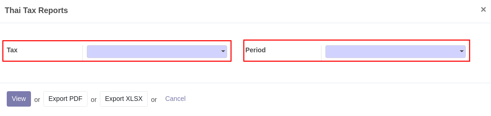
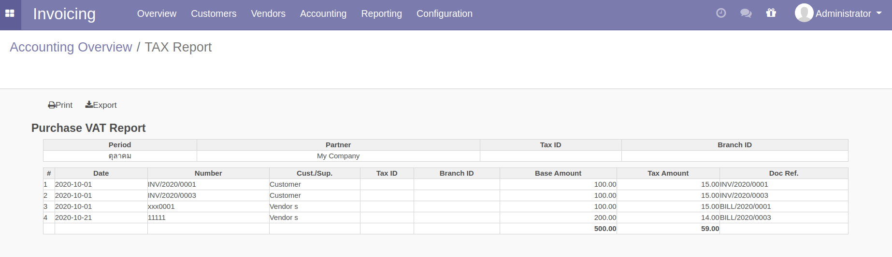

Account: Thai Tax Report
==========================

l10n_th_tax_report เป็นโมดูลที่สามารถออกรายงานภาษีขายและภาษีซื้อ เพื่อช่วยในการทำรายงานภาษีมูลค่าเพิ่ม สามารถใช้งานได้โดย

โมดูลที่ใช้
-------------

**Odoo 13.0**

* `l10n_th_tax_invoice <https://odoo-community.org/shop/product/thai-localization-account-tax-invoice-5087>`_
    โมดูลหลักในการบันทึกภาษีเข้ารายการ Tax Invoice

* `l10n_th_tax_report <https://github.com/OCA/l10n-thailand/tree/13.0/l10n_th_tax_report>`_
    เป็นโมดูลที่ใช้สำหรับดูรายงานทางภาษี

การดูรายงาน Tax Report
---------------------------

การทำรายงานภาษีมูลค่าเพิ่ม สามารถเรียกดูได้ตามขั้นตอน ดังนี้

1. เข้าไปที่ Invoicing > Reporting > Thai Tax Report

.. image:: images/tax_report/1.png

2. เลือกประเภทภาษี และช่วงเวลาที่ต้องการออกรายงาน

3. เลือกรูปแบบรายงานที่ต้องการ

ตัวอย่างรายงานที่ได้
###################

